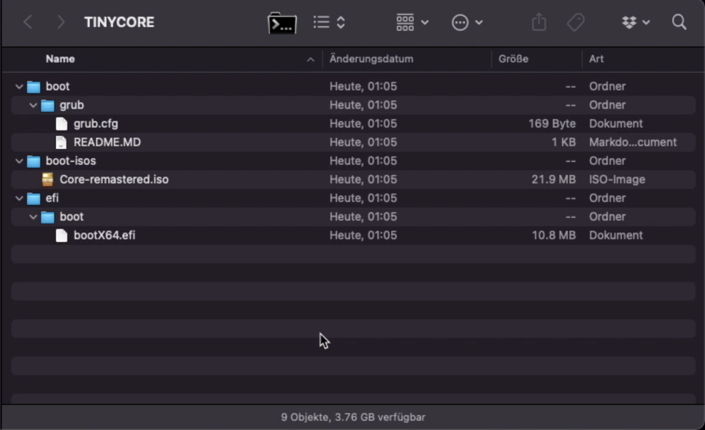

# Tiny Core Linux Extension for Vintage Mac Target Display Mode

Well, if you ended up here, you're propably running Linux on a Vintage Mac and trying to enable Target Display Mode.

Luckily enough, Florian Echtler did some research on the topic and shared his improvements to
[smc_util](https://github.com/floe/smc_util/) several years ago.

I had myself already used my dated 27" 2009 iMac for several years in target display mode,
simply because it has a nice display and it would be shame to throw away.

However, the hard drive died recently, so I was trying to make it boot Linux from a USB thumb drive
to enable target display mode on the go.

# The Problem

Well, one thing that really bothered me was the need to install a full-blown operating system to simply run as a dumb display.
But even the smallest Debian or Ubuntu weigh-in at several hundred MiB, which is too much bloat. I wanted something small.

# The Solution

This is where [Tiny Core Linux](http://tinycorelinux.net/) comes into play!

It's well maintained, and in it's smallest incarnation less than 30 MiB, just about enough to boot up and run a few scripts.
So the idea was born ...


# Technical Approach

This repository packages a bunch of scripts and other modifications, a `Dockerfile` and EFI boot loader, to assist you
not only building a package file for Tiny Core Linux, but to also assemble everything together for a bootable USB thumb drive,
that you can boot off your vintage Mac.


## Staging a Docker container as a Build Environment

I based this off Docker, to stage the build environment for the Tiny Core Linux extension inside a container environment.

Start as follows:
 
```
git clone https://github.com/gpdm/tinycore-targetdisplaymode.git
cd tinycore-targetdisplaymode 
docker build . -t tcbuild
``` 


## Run the build inside the container

Now that your container was built, create an `output` directory, then simply run the container.

```
docker run -it --rm -v `pwd`/output:/tmp/output tcbuild
```

This will run all necessary steps to

 * download the [smc_util](https://github.com/floe/smc_util/) source and compile it
 * download [Tiny Core Linux](http://tinycorelinux.net/) release 13 ISO
 * package the smc_util as a TCE extension package
 * restage the Tiny Core Linux ISO file into a custom respin
 * copy all files with the necessary structure to the `output` directory

Pay close attention to the build process. It's verbose, but there's not much error checking,
so it may fail at any time in the future (i.e. outdated download links, and such).

If it succeeds, you should have something like this in your `output` directory:

```
output/
output/boot
output/boot/grub
output/boot/grub/README.MD
output/boot/grub/grub.cfg
output/efi
output/efi/boot
output/efi/boot/bootX64.efi
output/boot-isos
output/boot-isos/Core-remastered.iso
```


## Creating a Bootable USB thumb drive

Now take any USB thumb drive, and proceed as follows:

 * Initialize the thumb drive with an *GPT* partition table (don't use MBR style)
 * create a single FAT32 partition
 * Copy all files from the `output` directory directly into the root directory of the USB thumb drive 

(i) The thumb drive should be no less than 64 MiB, but also not bigger. Everything above 64 MiB works of course, but is simply a waste.


### Initalizing the USB drive in MacOS Terminal

Check out the device list using `diskutil list` command, whereas you'll get something like this:

```
<shortened for brevity>

/dev/disk3 (external, physical):
   #:                       TYPE NAME                    SIZE       IDENTIFIER
   0:     FDisk_partition_scheme                        *4.0 GB     disk3
   1:                 DOS_FAT_32 USBVOLUME               4.0 GB     disk3s1
```

This stick is having an MBR-type partition type, so it needs to be reinitialized.

! Be very careful here to not accidentally format the wrong drive !

Here's a sample command line for `/dev/disk3`:

```
diskutil partitionDisk /dev/disk3 1 GPT MS-DOS TINYCORE 0
```

The above would initialize the drive as follows:

 * GPT partition table
 * creates one hidden EFI partition
 * creates one MS-DOS/FAT32 partition
 * sets a label "TINYCORE"
 * and fills all available disk space to the max

Upon reinspection, you will see something like this with the `diskutil list /dev/disk3` command:

```
/dev/disk3 (external, physical):
   #:                       TYPE NAME                    SIZE       IDENTIFIER
   0:      GUID_partition_scheme                        *4.0 GB     disk3
   1:                        EFI EFI                     209.7 MB   disk3s1
   2:       Microsoft Basic Data TINYCORE                3.8 GB     disk3s2
```

### Example of files contained on the USB drive



## How to Use

Well, once you have prepared your USB thumbdrive and copied all files over,
insert it into your iMac. Make sure that your second system is already wired-up with the graphics cable.
Then power your iMac on.

 * Press OPTION (ALT) key during power on. You should get several icons, one showing up as "EFI Boot".
   Select this one to boot.

 * You'll be presented with the GRUB boot menu.

 * Choose "Detect and show boot methods" option and hit ENTER.

 * After a few moments, you should get new options on display. Navigate to "Tiny Core Linux" option and press ENTER.

 * It should take a few seconds to boot up. Be patient and don't panic when it stalls for 10 seconds.
   That's because the system waits for the USB to settle.

 * Eventually, the extensions should be loaded.
 
 * If your second system is wired up (it should!), the iMac will automatically switch into Target Display Mode.
   If no system is connected, you may loose your display, as it may still turn black. DON'T PANIC and read along below!


### Switching Between Display Modes

If no other device is connected, your iMac may display nothing (blank screen) in some cases.
This may also be the case if the graphics cable is not properly seated.

But behold, you can use shortcuts to switch between display modes as indicated:

| Keystroke | Description |
| --- | --- |
| CTRL+ALT+F1, press <ENTER> | Bring up the system default console (will only be available if Target Display Mode was disabled) |
| CTRL+ALT+F2, press <ENTER> | Toggle between Target Display Mode and Local Display Mode. This is most similar in behaviour to Apples CMD+F2 key stroke. |
| CTRL+ALT+F3, press <ENTER> | This will turn on Target Display Mode, and your iMac should now act as a secondary display to your other Mac. |
| CTRL+ALT+F4, press <ENTER> | This will turn off Target Display Mode, and your iMac should show the local Linux console. |


## Customizations

### Device Identifiers in Grub Config

The configuration as seen fits well for my own purpose.
There might be cases, where it actually has to be adapted to your specific environments.

One of the more obvious ones is [grub.cfg](files/grub/grub.cfg), which contains the
boot instructions for Tiny Core Linux.

Please read the extra [instructions](files/grub/README.md) for details concerning
device identifiers, which may need to be changed depending on your system an in accordance
to the actual partitioning of your USB key.

### Boot Loader

This repository includes a general purpose GRUB boot loader from [Super Grub2 Disk](https://www.supergrubdisk.org/super-grub2-disk/)
for EFI64 systems. This is at least compatible to iMac 2009 and later models.

There may be cases, where this does not work and a 32bit EFI loader is needed.
This can also be found on the same location, however I can make no guarantee that it actually works,
as I had never tested this.


## Attributions

 * Florian Echtler for [smc_util](https://github.com/floe/smc_util/)
 * The developers of [Super Grub2 Disk](https://www.supergrubdisk.org/super-grub2-disk/)
 * The developers of [Tiny Core Linux](http://tinycorelinux.net/) 
